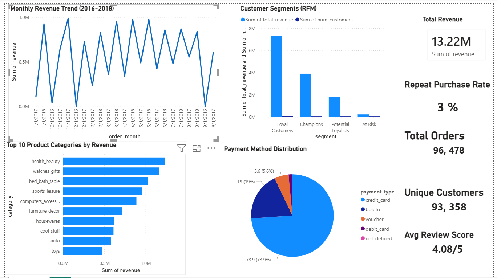

# E-Commerce Sales & Consumer Behaviour Analysis

## Project Overview
An end-to-end data analysis project on the **Olist Brazilian E-Commerce dataset**.
Goal: uncover revenue drivers, seasonal demand patterns, underperforming markets, and customer segments using **Python, SQL, and Power BI**.

---

## Dataset
- **Source:** [Olist Brazilian E-Commerce – Kaggle](https://www.kaggle.com/datasets/olistbr/brazilian-ecommerce)
- **Size:** 96,478 delivered orders | 9 relational CSV files | 2016–2018

---

## Tools Used
| Tool | Purpose |
|------|---------|
| Python (Pandas, Matplotlib, Seaborn) | EDA, data cleaning, visualizations |
| MySQL | Relational queries, KPI extraction |
| Power BI Desktop | Interactive dashboard |
| Google Colab / Jupyter Notebook | Analysis environment |

---

## Key Insights

| Metric | Finding |
|--------|---------|
| Total Revenue | R$ 13,279,836.59 |
| Total Orders | 96,478 |
| Unique Customers | 93,358 |
| Avg Order Value | R$ 119.81 |
| Avg Review Score | 4.08 / 5 |
| Top 3 Categories | Health & Beauty, Watches, Bed/Bath |
| Top 3 Revenue Share | 26.23% of total sales |
| Peak Revenue Month | November 2017 (R$ 987,765) |
| Top State | SP — R$ 5,067,633 (38% of revenue) |
| Repeat Purchase Rate | 3% (largely one-time buyers) |
| Top Payment Method | Credit Card — 73.92% of transactions |

---

## Power BI Dashboard
The interactive dashboard includes:
- **Monthly Revenue Trend** — seasonality and growth patterns
- **Top 10 Product Categories** — revenue and % share
- **Regional Performance** — revenue by Brazilian state
- **Customer Segments** — RFM analysis (Champions, Loyal, At Risk)
- **Payment Method Distribution** — transaction share by type
- **KPI Cards** — Total Revenue, Orders, Customers, Avg Order Value

---

## Project Structure
```
ecommerce-sales-analysis/
├── data/                              # Raw CSVs from Kaggle (not in repo)
│   └── README_data.md                 # Download instructions
├── sql/
│   ├── 01_schema_setup.sql            # Create MySQL tables
│   ├── 02_revenue_analysis.sql        # Revenue by category/region/month
│   ├── 03_customer_analysis.sql       # CLV, repeat rate, RFM
│   ├── 04_product_kpi_analysis.sql    # Top products, MoM growth
│   └── 00_master_kpi_single_result.sql # All KPIs in one query
├── notebooks/
│   └── ecommerce_analysis.ipynb       # Full Python EDA + charts
├── exports/
│   ├── export_monthly_revenue.csv
│   ├── export_category_revenue.csv
│   ├── export_state_revenue.csv
│   ├── export_rfm_segments.csv
│   └── export_payment_methods.csv
├── fast_load.py                       # Fast MySQL data loader
└── README.md
```

---

## How to Run

### Python EDA
1. Open `ecommerce_analysis.ipynb` in Google Colab
2. Upload all 8 CSV files from Kaggle
3. Run all cells to generate charts and export CSVs

### SQL Analysis
1. Run `fast_load.py` to load all CSVs into MySQL
2. Open MySQL Workbench → run SQL scripts in order
3. Run `00_master_kpi_single_result.sql` to get all KPIs in one result

### Power BI Dashboard
1. Open Power BI Desktop
2. Get Data → Text/CSV → import all 5 export CSVs
3. Build visuals using the exported data
   

---

## Requirements
```
pandas
sqlalchemy
pymysql
matplotlib
seaborn
```
Install: `pip install -r requirements.txt`
